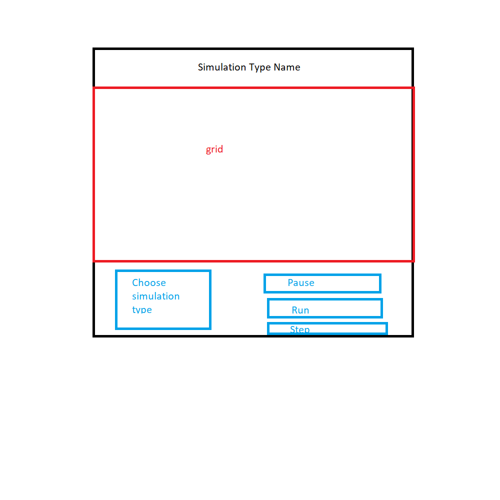

# Simulation Design Plan
### Team Number 23
### Names: Heather Grune (hlg20), Katherine Barbano (kab134), Priya Rathinavelu (plr11)

## Design Overview

* Package 1: Model - creates and stores all components and their states
    * Grid(SIMULATION_TYPE) - Contain Cells, getUpdatedGrid (returns new Grid with updated states - iterate through current Grid to 
    create new Grid with new Cell objects from current Cell objects by calling createNewCellWithUpdatedState)
    * Cell(SIMULATION_TYPE) - private var state, responsible for keeping track of what state it is in, createNewCellWithUpdatedState 
    (calls Neighborhood.getNextState, then return new Cell(state argument, SIMULATION_TYPE) whose state argument is the result of Neighborhood.getNextState),
    createNeighborhood (switch statement to decide which subclass of neighborhood to create by comparing the SIMULATION_TYPE constant)
    * Neighborhood (SIMULATION_TYPE) - contains cells that border a central cell (for middle cells, that means
    Neighborhood contains a total of 8 cells, and border cells would contain fewer cells than that), getNextState (abstract, applied rules of 
    whichever simulation it is to get next state). Neighborhood subclasses represent Neighborhood rules for each specific simulation type
    * Enum RockPaperScissorsStates - ROCK, PAPER, SCISSORS
    * Enum GameOfLifeNeighborhood - ALIVE, DEAD
* Package 2: View  
    * State - color, 
    * CellDisplay extends Rectangle, constant HashMap with state keys and color values, read state of Cell to pick color,
     add itself to Scene children, methods for determining width and height from Scene size. 
     Constructor (x Pos, y Pos, Scene width and height, state)
     * css
    Adds components to the scene
    * setupScene()
    * CellArray
* Package 3: Controller (what the user interacts with)
    * Main - start simulation, stop, pause
    * Handle changing between types of simulations -> handleChangeSimulation()
    * step() function (updates both backend and frontend)
    * Update components in the simulation--> updates both view and model
    * Simulation abstract
        * Keep track of the states that each simulation contains, keeps track of the simulation type
        * Contains both current Grid (the one on the screen right now) and the next Grid
        * clear old grid from Scene (iterate through old Grid and remove old CellDisplays from Scene), add new grid to Scene (iterate through the new Grid object and create new CellDisplay for each Cell)
        * Reads in the configuration file to make first initial Grid
        * Enum Simulation Type - GAME_OF_LIFE, ROCK_PAPER_SCISSORS, etc
        * Subclasses GameOfLifeSimulation, RockPaperScissorsSimulation... etc

## Design Details
Our main abstract class is our Simulation Class. Each type of simulation we need to implement will
be extending the main Simulation class. Within this simulation, we will have an instance of a 
current Grid with all of the cell's current states, as well as a "next" Grid which will store the 
new states of all the cells. Each Grid object is made up of a collection of Cell objects. Each 
Cell is responsible for knowing which state it is supposed to be, and as the simulation updates, 
each cell will have to update its state. To help with understanding its own state, each Cell
will contain an instance of Neighborhood object, which will be an extension of the Neighborhood
abstract class. This class is abstract because each cell's states need to updated differently 
according to what simulation is running. By having Neighborhood be abstract, the method in this 
class that can figure out a cell's new state can be overriden based on which simulation has to run. 
Each instance of Simulation will also take in a file resource name indicating the file that will 
be read in to create the general grid shape. This is how the different states of the cells can be 
stored and updated. To actually display these states, the Simulation class will work with the 
CellDisplay class that is under the View branch of the project. The CellDisplay class works
by extending Rectangle and contains a structure that can store all possible states and which 
colors that each states corresponds to. This class will also be responsible for directly 
displaying the cell's state on the scene. As we update based on a certain amount of time, the 
grid will be updated to reflect the new cell states. This will then be displayed on the scene as 
the "new" grid. 

Our Main class would be in charge of starting, stopping, pausing, and transitioning between
the current simulation to be displayed. 

Here is a graphical look at my design:

made from [a tool that generates UML from existing code](http://staruml.io/).

## Design Considerations

1) We considered having Simulation in the Model, but decided to put it in the Controller
instead because it has to vary over the elapsed time to create new Grid objects. Because it
is varying over time, we thought it should be closer to the step method, so we put it in the Controller.

2) We considered having Neighborhood be concrete, and having the simulation hierarchy take care
of any type of polymorphism. However, we decided to make Neighborhood abstract because the getNextState
method varies based on the different rules of each simulation. We thought this followed the Single
Responsibility Principle more closely, since having getNextState in Neighborhood is essential to the
class' function.

## User Interface

Here is our amazing UI:

## Team Responsibilities

 * Team Member #1: Katherine - will focus on Model

 * Team Member #2: Priya - will focus on Controller

 * Team Member #3: Heather - will focus on View
